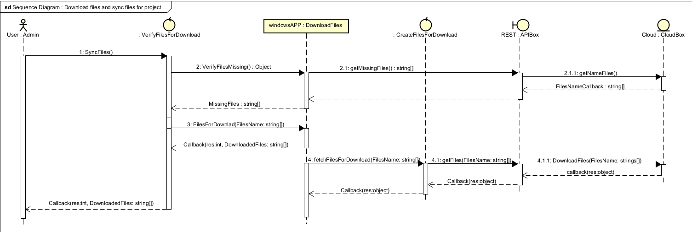

# CloudX Sync

A comprehensive Windows application for synchronizing local project files with Box cloud storage and Firebase, featuring real-time file monitoring and automated backup capabilities.

## 🔥 Technical Highlights

- **Enterprise-Grade Asynchronous Architecture**: Built with .NET 9.0's latest async/await patterns, implementing thread-safe queue management with ConcurrentQueue, background TaskScheduler orchestration, and FileSystemWatcher event debouncing to handle thousands of simultaneous file operations without blocking the UI thread or causing race conditions.

- **Multi-Cloud OAuth JWT Authentication Pipeline**: Implements RFC 7523 JWT Bearer Token authentication with RSA-256 encrypted private keys for Box Enterprise API, combined with Firebase Admin SDK service account impersonation, featuring automatic token refresh, secure credential vault management, and OAuth 2.0 PKCE flow with localhost callback interception.

- **Real-Time Distributed State Synchronization**: Leverages Firebase Firestore's real-time listeners with conflict resolution algorithms, implementing vector clocks for distributed file versioning, delta synchronization with binary diff algorithms, and atomic transaction batching to maintain data consistency across multiple devices and cloud storage providers simultaneously.

## 🚀 Features

- **Real-time File Synchronization**: Automatically sync local projects with Box cloud storage
- **File System Monitoring**: Detects file changes, additions, deletions, and renames in real-time
- **Firebase Integration**: Store and manage project metadata in Firebase
- **Box.com Integration**: Upload and manage files on Box cloud storage
- **Windows Forms GUI**: User-friendly interface for managing projects and sync settings
- **System Tray Support**: Minimize to system tray for background operation
- **Project Management**: Create, configure, and manage multiple sync projects
- **Authentication**: Secure OAuth authentication for Box and Firebase services
- **Queue Management**: Intelligent file upload queue with error handling
- **Configuration Management**: YAML-based configuration system

## 🏗️ Architecture

The application follows a modular architecture with clear separation of concerns:

```text
CloudX.Sync/
├── Views/              # Windows Forms UI components
├── Managers/           # Core business logic managers
│   ├── Cloud/         # Cloud storage management
│   ├── Uploaders/     # File upload handlers
│   ├── Downloaders/   # File download handlers
│   └── Firebase/      # Firebase integration
├── Models/            # Data models and entities
├── Services/          # External service integrations
│   └── API/          # Authentication services
├── Helpers/           # Utility and helper classes
├── Utils/             # Common utilities
└── Resources/         # Application resources
```

### Application Flow

The following diagram illustrates the sequential flow of the synchronization process:



## 🛠️ Technology Stack

- **.NET 9.0** - Modern .NET framework
- **Windows Forms** - Desktop GUI framework
- **Box SDK** - Box.com cloud storage integration
- **Firebase Admin SDK** - Firebase backend services
- **FileWatcherEx** - Enhanced file system monitoring
- **YamlDotNet** - YAML configuration parsing
- **Newtonsoft.Json** - JSON serialization

## 📋 Prerequisites

- Windows 10/11
- .NET 9.0 Runtime
- Box.com developer account with API credentials
- Firebase project with service account

## ⚙️ Configuration

### 1. Box API Setup

Create a Box application at [Box Developer Console](https://developer.box.com/) and obtain:

- Client ID
- Client Secret
- Developer Token (for development mode)

### 2. Firebase Setup

Create a Firebase project and generate:

- Service account credentials
- Project ID

### 3. Application Configuration

Edit `appsettings.yaml`:

```yaml
DefaultPathForProjects: "C:\\YourProjectsPath"
MetaDataPath: "config/"
Development: false  # Set to true for development mode
SyncInterval: 300   # Sync interval in seconds

APIConfigs:
  Token: "your_box_developer_token"
  ClientId: "your_box_client_id"
  ClientSecret: "your_box_client_secret"
  # ... other Box API configurations

FirebaseAppID: "your_firebase_project_id"
```

## 🚀 Getting Started

### Installation

1. Clone the repository:

```bash
git clone https://github.com/your-username/cloudx-sync.git
cd cloudx-sync
```

2. Restore NuGet packages:

```bash
dotnet restore
```

3. Configure your API credentials in `appsettings.yaml`

4. Build and run:

```bash
dotnet build
dotnet run
```

### First Time Setup

1. **Launch the application**
2. **Configure API credentials** through the Configuration panel
3. **Add projects** to sync using the Projects manager
4. **Start synchronization** to begin monitoring and uploading files

## 📖 Usage

### Project Management

- **Add Project**: Create a new sync project by specifying a local directory
- **Configure Sync**: Set up sync rules and exclusions for each project
- **Monitor Status**: View real-time sync status and file change logs

### File Synchronization

The application automatically monitors configured project directories and:

- Uploads new files to Box storage
- Syncs file modifications
- Handles file and folder renames
- Manages file deletions
- Updates metadata in Firebase

### System Tray Operation

- Minimize the application to system tray for background operation
- Right-click tray icon for quick access to sync controls
- View sync status and recent activity from the tray menu

## 🔧 Development

### Project Structure

- **Views**: Windows Forms UI components and user interaction
- **Managers**: Core business logic for sync operations
- **Models**: Data structures for projects, files, and sync status
- **Services**: External API integrations (Box, Firebase)
- **Helpers**: Configuration management and utilities

### Key Components

- `SyncManager`: Orchestrates file synchronization operations
- `ProjectManager`: Handles project lifecycle and metadata
- `QueueManager`: Manages file upload queue with retry logic
- `FileWatcherEx`: Monitors file system changes in real-time
- `BoxUploader`: Handles file uploads to Box storage

### Adding New Features

1. Create appropriate model classes in `Models/`
2. Implement business logic in `Managers/`
3. Add UI components in `Views/`
4. Update configuration schema if needed

## 🧪 Testing

Run the test suite:

```bash
dotnet test
```

## 📝 Logging

The application provides comprehensive logging for:

- File synchronization events
- API interactions
- Error tracking and debugging
- Performance monitoring

Logs are available through the application GUI and can be exported for analysis.

## 🤝 Contributing

1. Fork the repository
2. Create a feature branch (`git checkout -b feature/amazing-feature`)
3. Commit your changes (`git commit -m 'Add amazing feature'`)
4. Push to the branch (`git push origin feature/amazing-feature`)
5. Open a Pull Request

## 📄 License

This project is licensed under the MIT License - see the [LICENSE](LICENSE) file for details.

## 🆘 Support

If you encounter any issues or have questions:

1. Check the [Issues](https://github.com/your-username/cloudx-sync/issues) page
2. Create a new issue with detailed information
3. Contact the development team

## 🗺️ Roadmap

- [ ] Linux and macOS support
- [ ] Additional cloud storage providers (Google Drive, OneDrive)
- [ ] Advanced file filtering and sync rules
- [ ] Bandwidth throttling and scheduling
- [ ] Team collaboration features
- [ ] Mobile companion app

---

**CloudX Sync** - Seamless project synchronization for the modern developer.

